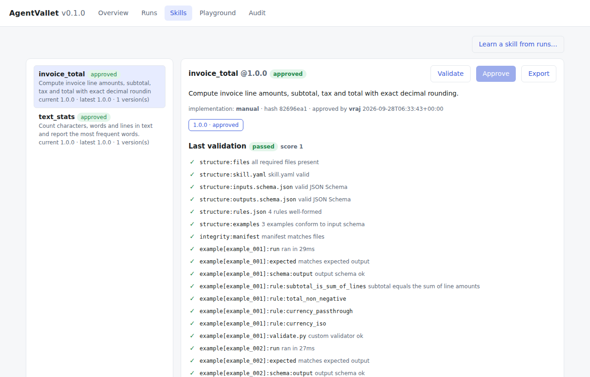
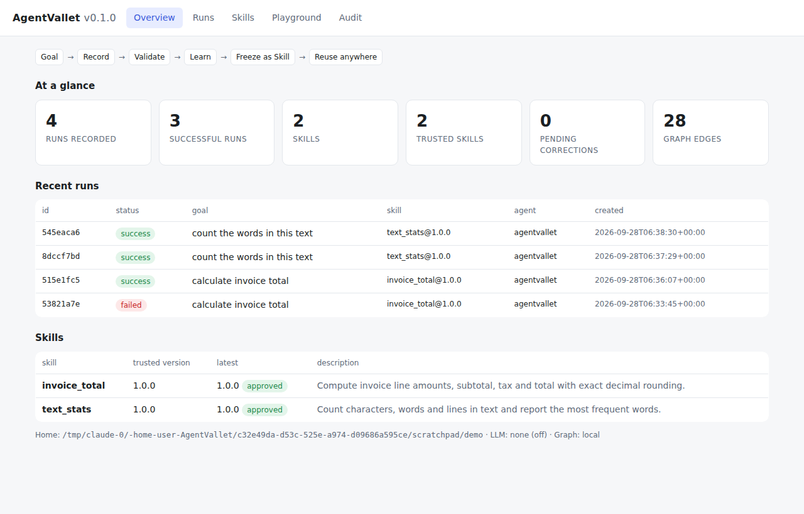

# AgentVallet

**Portable AI Work, Memory & Skill Brain**

[](https://github.com/vrajkher/AgentVallet/actions/workflows/ci.yml)


AgentVallet records AI-assisted work that succeeded and turns it into skills that are portable,
readable by people and machines, tested, and reusable. A skill is a plain folder of Markdown,
YAML/JSON and a Python script. ChatGPT, Claude, Codex, Cursor, local LLMs, ERPNext/Frappe agents,
or a shell script can read and run it without AgentVallet installed.

```text
Goal -> Record observable work -> Validate -> Learn -> Freeze as Skill -> Reuse anywhere
```



## Contents

- [Status](#status)
- [Install](#install)
- [Quick start](#quick-start)
- [Core concepts](#core-concepts)
- [How learning works](#how-learning-works)
- [Interfaces](#interfaces): [CLI](#cli), [Python](#python-api), [REST](#rest-api), [MCP](#mcp), [Dashboard](#dashboard)
- [Architecture](#architecture)
- [Project layout](#project-layout)
- [Configuration](#configuration)
- [Development](#development)
- [Limitations and roadmap](#limitations-and-roadmap)
- [Safety boundary](#safety-boundary)

## Status

**v0.1.0: working.** Every component in the architecture below is implemented and tested: 66 tests, run in CI on
Python 3.11, 3.12 and 3.13. The optional Claude and Graphiti integrations are implemented, but they have only been
tested with stubs or with their local fallbacks (see [Limitations](#limitations-and-roadmap)).

## Install

```bash
git clone https://github.com/vrajkher/AgentVallet.git
cd AgentVallet
python -m venv .venv && source .venv/bin/activate
pip install -e ".[api,mcp]"
av init
av doctor
```

| Extra | Adds | Needed for |
|---|---|---|
| *(core)* | pydantic, pyyaml, jsonschema, typer, rich | recording, learning, validation, the CLI |
| `api` | fastapi, uvicorn, httpx | `av serve` (REST API and dashboard) |
| `mcp` | mcp | `av mcp` (Claude, Cursor and other MCP clients) |
| `llm` | anthropic | LLM program synthesis and repair |
| `graph` | graphiti-core | the Graphiti graph backend |
| `dev` | pytest, ruff, mypy | development |

## Quick start

```bash
# 1. Record work (from any agent, script, the REST API or MCP)
RUN=$(av record start "Convert celsius to fahrenheit" --tag units)
av record step $RUN input  -d '{"celsius": 100}'
av record step $RUN code - <<'EOF'
import json, sys
d = json.load(sys.stdin)
print(json.dumps({"fahrenheit": d["celsius"] * 9 / 5 + 32}))
EOF
av record step $RUN output -d '{"fahrenheit": 212.0}'
av record finish $RUN
# ...record a couple more runs...

# 2. Learn a draft skill (validated automatically)
av learn --goal "convert celsius to fahrenheit" --name c_to_f

# 3. Approve it: this needs a named person, and the approved version becomes immutable
av skill approve c_to_f 1.0.0 --by you

# 4. Reuse it: routes the task to the best trusted skill, then runs, validates and repairs
av execute "change 37 celsius into fahrenheit" -i '{"celsius": 37}'

# 5. Correct it: corrections are the highest-priority learning signal
av correct "must never go below absolute zero" --skill c_to_f \
  --rule '{"type": "range", "path": "fahrenheit", "min": -459.67}'
av learn --name c_to_f          # -> c_to_f@1.1.0 (1.0.0 stays trusted and unchanged)
av skill diff c_to_f 1.0.0 1.1.0

# 6. Move it anywhere
av skill export c_to_f --out .  # c_to_f-1.0.0.avskill.zip, with a verifiable manifest
```

Try the ready-made example skills:

```bash
av skill add examples/invoice_total && av skill validate invoice_total
av skill approve invoice_total 1.0.0 --by you
av execute "calculate the invoice total" -i '{"currency": "USD", "tax_rate": 0.08,
  "items": [{"sku": "A-1", "qty": 2, "unit_price": 19.99}]}'
```

## Core concepts

| Concept | Meaning |
|---|---|
| **Run** | One piece of recorded work: a goal plus ordered steps (input, output, prompt, response, code, tool call, command, file, note, error). It ends as `success` or `failed`. |
| **Correction** | A person's fix, linked to a skill or a run. It can be a note, a **rule** (for example `total >= 0`) or an **example** (`input` → `expected_output`). Corrections always take priority over learned behavior. |
| **Skill package** | A portable folder with `skill.yaml`, `run.py`, schemas, `rules.json`, examples, tests, `validate.py`, docs and a `manifest.json` of file hashes. See the [spec](docs/SKILL_SPEC.md). |
| **Version lifecycle** | `draft` → `validated` → `approved` → `deprecated`. Approval needs a named person and a passing validation of the exact content hash. An approved version is read-only and checked for changes every time it loads. Any change produces a new version. |
| **Validation** | Structure, the manifest, every example (the output must match the expected output), `rules.json`, `validate.py`, and the package's own `tests/`. |
| **Trust** | Stays on the machine that granted it. An imported skill always lands as a draft and has to be validated and approved again. |

## How learning works

For each learning request, the engine:

1. Selects successful runs (by id, similar goal, or earlier executions of the skill) and pulls out their `(input, output)` pairs.
2. Applies pending **human corrections**. Rule corrections become error-severity rules. Example corrections override recorded outputs for the same input.
3. Infers `inputs.schema.json` and `outputs.schema.json`, and mines rules that hold across *all* examples, such as `total == sum(items[*].amount)`, `customer` copied from the input, non-negative values, and ISO dates.
4. Chooses the first implementation that reproduces **every** example:
   - **recorded**: code captured in a run that follows the stdin→stdout contract.
   - **synthesized**: a generated program in which each output field is a copy, sum, count, mean, min, max or constant over the input.
   - **llm**: Claude writes `run.py`. It is checked against every example and retried with feedback. Requires `AV_LLM_PROVIDER=anthropic`.
   - **lookup**: memorizes the known pairs and rejects unseen input. This is flagged in `exceptions.md`.
5. Writes a new **draft** version with its provenance and validates it. It is trusted only after a person approves it.

When an execution fails, the repair loop tries these in order: **retry** (after a timeout) → **fall back** to the previous approved version → **LLM patch**, saved as a new draft → **escalate** to a person for a correction.

## Interfaces

### CLI

Run `av --help` or `av <command> --help` for details. Add `--json` for machine-readable output and `--home` to pick a different store.

| Command | Purpose |
|---|---|
| `av init` · `av doctor` · `av stats` | set up the store, check health and integrity, show counts |
| `av record start / step / file / exec / finish / json` | record work step by step, or import a whole run from JSON |
| `av runs list / show` | inspect recorded runs |
| `av correct TEXT --skill/--run [--rule JSON] [--example JSON]` | add a correction |
| `av learn [--name] [--goal] [--run ...]` | learn and validate a draft version |
| `av skill new / add / list / show / validate / approve / deprecate / fork / diff / export / import / path` | manage skill versions |
| `av route TASK` · `av run NAME -i JSON` · `av execute TASK -i JSON` | reuse skills |
| `av graph search / neighbors / stats` · `av audit log / verify` | memory graph and audit trail |
| `av serve` · `av mcp` | dashboard and REST API; MCP server |

JSON arguments accept inline JSON, `@file.json` or `-` (read from stdin).

### Python API

```python
from agentvallet import AgentVallet

av = AgentVallet()                      # uses AV_HOME or ~/.agentvallet
with av.record("Sum invoice lines", tags=["finance"], agent="my-agent") as run:
    run.input({"items": [{"amount": 2.5}, {"amount": 4}]})
    run.prompt("add the amounts")
    run.output({"total": 6.5})
# a failure raised inside the block marks the run as failed

res = av.learn(goal="sum invoice lines", name="invoice_sum")
report = av.validate("invoice_sum", res.version.version)
av.approve("invoice_sum", res.version.version, approver="vraj")
print(av.execute("add up this invoice", {"items": [{"amount": 1}, {"amount": 2}]}).output)
```

### REST API

Start it with `av serve`. Interactive OpenAPI docs are at <http://127.0.0.1:8765/docs>. Set `AV_API_TOKEN` to require `Authorization: Bearer <token>`.

| Method | Path | Purpose |
|---|---|---|
| `POST` | `/api/runs` | record a complete run `{goal, steps[], status}` |
| `POST` | `/api/runs/{id}/steps`, `/api/runs/{id}/finish` | record a run step by step |
| `GET` | `/api/runs`, `/api/runs/{id}`, `/api/artifacts/{hash}` | inspect runs and artifacts |
| `POST` | `/api/corrections` | add a correction |
| `POST` | `/api/learn` | learn and validate a draft |
| `GET` | `/api/skills`, `/api/skills/{name}`, `/api/skills/{name}/{version}/files/{path}` | browse skills |
| `POST` | `/api/skills/{name}/{version}/validate`, `/approve`, `/deprecate` | trust workflow |
| `GET` | `/api/skills/{name}/diff?a=&b=`, `/api/skills/{name}/{version}/export` | diff versions; download a portable zip |
| `POST` | `/api/route`, `/api/execute` | reuse skills |
| `GET` | `/api/graph/search?q=`, `/api/audit`, `/api/audit/verify`, `/api/stats`, `/api/doctor` | memory, audit trail, health |

### MCP

```json
{"mcpServers": {"agentvallet": {"command": "av", "args": ["mcp"]}}}
```

Tools: `route_task`, `run_skill`, `execute_task`, `record_run`, `learn_skill`, `add_correction`, `get_skill`,
`list_skills`, `search_memory`. The server's instructions tell clients to call `route_task` before solving a task from scratch,
to call `record_run` (with the code they used) after succeeding, and to call `add_correction` when a result is wrong.

### Dashboard

`av serve` → <http://127.0.0.1:8765/>. It is a single self-contained page with no CDN, so it works offline, and it supports
light and dark mode on desktop and phone. It covers the overview, runs (with inline corrections), skills (validation
report, rules, files, version diff, validate, approve and export), a playground for route and execute, and the audit log.



## Architecture

```text
AI Desktop / CLI / REST / MCP / ERP / Local Agent
              |
              v
        Work Recorder  (secret redaction, command capture, file snapshots)
              |
      +-------+--------+
      v                v
 Exact Run Store   Artifact Store
   (SQLite +        (sha256
  audit chain)     content-addressed)
      +-------+--------+
              v
        Learning Engine  (schema inference, invariant mining, program synthesis,
              |           recorded-code adoption, optional LLM, corrections first)
      +-------+--------+
      v                v
 Portable Skill     Graph Index
 (versioned dirs)   (local SQLite graph | Graphiti)
      |
      v
 Skill Router -> Runner -> Validator -> Repair -> Approve -> New Version
```

Design principles:

- The core runs locally and stays lightweight.
- The exact history lives in SQLite plus content-addressed files. The audit log is **hash-chained and append-only**.
- Skills are portable: Markdown, YAML/JSON and scripts.
- Deterministic validation comes before trust.
- A person's correction is high-priority learning.
- Graph memory is an index, not the source of truth.
- Every skill is versioned, and trusted knowledge is never silently overwritten.
- Only observable work is recorded, never hidden chain-of-thought.

## Project layout

```text
src/agentvallet/
├── core.py        AgentVallet facade that connects all the components
├── config.py      settings (environment variables)
├── models.py      Pydantic models: Run, Step, Correction, SkillVersion, ValidationReport, ...
├── store/         SQLite database + migrations + audit chain, runs, artifact store
├── recorder/      WorkRecorder / RunHandle, secret redaction
├── spec/          skill package build/load/manifest, rule engine, JSONPath subset
├── runner/        sandboxed runner, validator
├── learning/      engine, schema and invariant mining, code generation, LLM providers
├── skills/        registry, router, repair loop, pipeline
├── graph/         local SQLite graph, Graphiti adapter
├── api/           FastAPI server + web/index.html dashboard
├── mcp/           MCP server
└── cli.py         `av` command-line interface
examples/          invoice_total, text_stats: complete reference skill packages
docs/              SKILL_SPEC.md, screenshots
tests/             pytest suite (store, spec, runner, learning, registry, pipeline, LLM paths, interfaces)
```

All state is stored under `AV_HOME` (default `~/.agentvallet`) as `agentvallet.db`, `objects/`, `skills/<name>/<version>/`
and `exports/`. To back it up or move it, copy the folder.

## Configuration

| Env var | Default | Meaning |
|---|---|---|
| `AV_HOME` | `~/.agentvallet` | where all state is stored |
| `AV_LLM_PROVIDER` | `none` | `anthropic` turns on LLM synthesis and repair (`pip install -e ".[llm]"`) |
| `AV_LLM_MODEL` | `claude-opus-5` | model used by the Anthropic provider |
| `AV_GRAPH_BACKEND` | `local` | `graphiti` (also set `AV_GRAPHITI_URI`, `AV_GRAPHITI_USER`, `AV_GRAPHITI_PASSWORD`) |
| `AV_RUN_TIMEOUT` | `60` | default skill timeout in seconds |
| `AV_ROUTE_THRESHOLD` | `0.5` | minimum router confidence for `execute` |
| `AV_REDACT` | `1` | set to `0` to turn off secret redaction |
| `AV_API_TOKEN` | unset | bearer token required by the REST API |

## Development

```bash
pip install -e ".[api,mcp,dev]"
ruff check src tests examples && ruff format --check src tests
mypy src
pytest -q
```

CI (`.github/workflows/ci.yml`) runs lint, type checks and tests on Python 3.11, 3.12 and 3.13, and validates the example skills.
To change the package format, update `docs/SKILL_SPEC.md` and `spec/`, then regenerate any example manifests.
Manifests are written by `SkillPackage.write_manifest()`.

## Limitations and roadmap

- **Program synthesis is intentionally narrow.** Without recorded code or an LLM, it can only learn field-wise
  copy, sum, count, mean, min, max or constant mappings. Anything else falls back to a lookup table that rejects unseen input.
- **The LLM path** (Anthropic) has only been tested with a stub provider. Its output is always re-validated and saved as a draft.
- **The Graphiti backend** has not been tested against a live Neo4j or FalkorDB instance. The local graph is the default and is tested.
- **The sandbox** is best-effort process isolation (temporary directory, environment allowlist, timeouts, POSIX rlimits),
  not a container or VM. Review a skill's `run.py` before you approve it.
- The router matches keywords (BM25 plus synonyms plus graph hints); it does not use embeddings.
- Possible next steps: embedding-based routing, container sandboxing, more synthesis operators, and signing of approvals and exports.

## Safety boundary

AgentVallet stores prompts, responses, scripts, files, corrections, validations and other observable execution artifacts that
the user explicitly provides or authorizes. It does not capture private hidden model reasoning. Values that look like secrets
(API keys, tokens, passwords, private keys) are redacted before storage. Skills run with an allowlisted environment only, so no
credentials are passed to them. Trust is local: imported skills always arrive as drafts.
